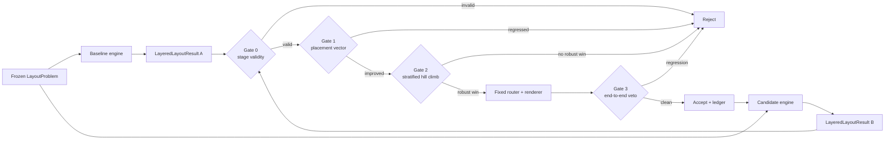

# Layered Layout Algorithm Feedback Loop

Status: design (node `dagre-feedback-loop`)
Owner: layout overhaul effort (see `docs/layout_overhaul_plan.md`, `docs/layout_objective.md`)

This document specifies a fully automated feedback loop for iterating on the
flowchart's layered node-placement algorithm. The optimization target stops at
the layout-engine boundary. Edge routing, edge-label placement, SVG rendering,
and rasterization are not part of the score being climbed. They run afterward
only as compatibility vetoes.

That distinction matters. Optimizing routed SVG metrics while changing node
placement makes it impossible to tell whether an apparent win came from the
layout algorithm, the router, or a later cleanup pass. The loop therefore
compares two implementations of one explicit interface:

```text
LayeredLayoutEngine::layout(LayoutProblem) -> LayeredLayoutResult
```

`LayoutProblem` contains the graph, measured node and edge-label sizes,
direction, compound membership, and fixed spacing/configuration. A
`LayeredLayoutResult` contains ranks, within-rank order, node coordinates,
compound bounds, feedback-arc decisions, and long-edge dummy chains. The same
serialized `LayoutProblem` is given to the baseline and candidate engines.

The downstream routing/rendering pipeline is held fixed. Its existing hard
gates may reject a candidate, but its soft score cannot make a placement
candidate look better.

The loop reuses and formalizes existing infrastructure:

| Concern | Existing artifact | Role in the loop |
|---|---|---|
| Current end-to-end metrics | `scripts/layout_score.py` | downstream veto/report source, not the optimization objective |
| Current hard validity | `scripts/hard_gate.py` | final compatibility veto |
| Current regression gate | `scripts/quality_gate.py` + `tests/quality_baseline.json` | downstream strict-metric veto |
| Mermaid comparison | `scripts/quality_bench.py --engine both` (mmdc cache) | external node-placement anchor |
| Current layout dumps | `src/layout_dump.rs` (`LayoutDump`) | basis for the proposed stage dump |
| Determinism | `tests/determinism_suite.rs` | precondition check |

## 1. Loop overview



One iteration = freeze the corpus into layout problems, run baseline and
candidate engines, compute placement vectors, evaluate gates 0-2, and finally
run the fixed downstream pipeline as gate 3. Gates are strictly ordered: a
later gate can never override an earlier one.

## 2. Determinism requirements (precondition)

The loop is only sound if metrics are bit-reproducible:

- Fixed `LayoutProblem` + engine => identical `LayeredLayoutResult`, byte for
  byte. The loop runner executes each engine twice and fails the whole
  iteration on any stage-dump mismatch. Existing full-render determinism tests
  remain a downstream check.
- No wall-clock, RNG (unseeded), thread-order, or HashMap-iteration-order
  dependence in layout code. Any stochastic search inside the layout
  algorithm must use a fixed seed derived from the fixture content hash.
- Font metrics come from the bundled deterministic text measurement
  (`src/text_metrics.rs`), never from system font fallback, when the loop
  runs. The runner sets the same config (`tests/fixtures/modern-config.json`)
  recorded in `tests/quality_baseline.json`.
- Mermaid-cli outputs are not assumed deterministic. They are cached by
  content digest (`mmdc_render_cache_digest`) and treated as a frozen
  reference snapshot, versioned by mmdc version string.

## 3. Deterministic placement metrics

Placement metrics are pure functions of `LayoutProblem` and
`LayeredLayoutResult`. They must not inspect routed edge points, label anchors,
SVG paths, or pixels.

### Tier H - stage validity (gate 0, must be zero)
- Missing, duplicated, or non-finite node/rank/order/coordinate values.
- Node rectangle overlaps after required spacing is applied.
- Rank-constraint violations on acyclicized edges (`rank(v) - rank(u) < minlen`).
- Invalid within-rank permutations or broken long-edge dummy chains.
- Compound containment escapes and foreign-node containment.
- Non-deterministic feedback-arc, rank, order, or coordinate decisions.

### Tier S - strict placement counts (gate 1)
- Adjacent-rank crossing count on the normalized dummy graph.
- Weighted feedback-arc count for cyclic inputs.
- Compound sibling overlap count and disconnected-component overlap count.
- Rank-direction reversals that are not selected feedback arcs.

These counts may not increase per fixture without an explicit, expiring
waiver. They are calculated before routing, so a router cannot hide them.

### Tier R - relative placement objectives (gates 1-2)
- Weighted rank span and dummy-node count.
- Centerline length proxy, normalized per edge.
- Layout area per node, fill ratio, and wasted-space ratio.
- Rank width/height variance and component balance.
- Median-alignment error and straight-segment preservation for long edges.
- Fan symmetry and sibling-spacing variance for structurally symmetric
  neighborhoods.
- Compound padding excess and nested-compound depth expansion.

### Tier A - reporting score
A weighted score may summarize results for dashboards, but it never overrides
the tier-H/S vector or the per-stratum tier-R budgets. The primary hill-climb
decision is Pareto-style over the metric vector, not a flat scalar.

### Downstream veto metrics
After a placement candidate wins gates 0-2, the fixed routing/rendering
pipeline runs once. `hard_gate.py` must remain green and the strict metrics in
`quality_gate.py` may not regress. Relative routed metrics are reported in the
ledger but are not part of the placement objective. This preserves end-to-end
correctness without teaching the placement solver to game one particular
router.

Metric hygiene rules:
- Every placement metric is a pure function of stage input + stage output.
- New metrics start in report-only mode for one baseline cycle before gating.
- Cross-fixture aggregates use per-node/per-edge normalization so large
  fixtures do not dominate.

## 4. Mermaid comparison (external anchor)

Self-referential metrics can drift toward degenerate optima, such as reducing
crossings by making the diagram enormous. A frozen mermaid-cli render provides
an external node-placement anchor:

- Extend the existing cached `quality_bench.py --engine both` path with a
  placement extractor that reads node bounding boxes from SVG and derives only
  comparable node-position metrics: projected ranks, within-rank order,
  centerline crossing proxy, area per node, component balance, and sibling
  symmetry. Routed bends, label anchors, and path lengths are excluded.
- Define per-fixture **relative placement quality**
  `rq(m) = candidate(m) / max(mmdc(m), ε)` for each comparable placement metric.
- Anchor rule: for each stratum, track the count of fixtures where candidate
  crossing proxy is worse than Mermaid and where area per node exceeds
  Mermaid by more than 50%. This `anchor_losses` count may not increase.
- The mmdc snapshot is versioned. Upgrading mmdc regenerates the anchor and
  requires a one-commit baseline refresh with no mmdr code changes, so anchor
  drift is never conflated with layout changes.
- The anchor is comparison-only. mmdc geometry is never copied into expected
  outputs; Mermaid has its own layout bugs and we only use it as a sanity
  bound, not a target.

## 5. Fixture stratification

A flat corpus average hides regressions: a win on 40 tiny fixtures can mask a
disaster on 3 mega fixtures. The corpus (215 baseline fixtures under
`tests/fixtures/`, plus `benches/fixtures/`) is stratified along two axes and
all gate decisions are made per stratum.

### Axis 1: size class (from parsed IR, deterministic)
| Class | Nodes | Edges |
|---|---|---|
| tiny | ≤ 8 | ≤ 10 |
| small | ≤ 25 | ≤ 40 |
| medium | ≤ 80 | ≤ 150 |
| large/mega | > 80 | > 150 |

### Axis 2: structural feature tags (from parsed IR)
Each fixture gets zero or more tags: `subgraphs`, `nested-subgraphs`,
`back-edges` (cycle present), `edge-labels`, `parallel-edges`, `self-loops`,
`multi-component`, `high-fanout` (max degree ≥ 6), `bipartite-dense`
(edge/node ratio ≥ 2), `direction-override`.

Tags are computed by the runner from the IR, not hand-maintained, so new
fixtures self-classify. The existing hard-fixture names
(`flowchart_mega_*`, `flowchart_subgraph_boundary_intrusion`, ...) already
cover most tag combinations; the runner reports uncovered (size × tag) cells
so corpus gaps become visible work items.

A **stratum** = size class × tag (plus one `all` stratum per size class).
Aggregation within a stratum uses mean and p95 of each normalized metric.

## 6. Regression budgets

Budgets bound how much any accepted change may cost, per metric tier:

- **Tier H:** budget is zero, always, per fixture. No exceptions and no
  averaging. A single invalid `LayeredLayoutResult` rejects the iteration.
- **Tier S:** budget is zero per fixture against a new
  `tests/layout_algorithm_baseline.json`. A tier-S regression can only be
  accepted by an explicit per-fixture waiver entry
  (`tests/layout_algorithm_waivers.json`: fixture, metric, old, new,
  justification, expiry commit count). Waivers are loud and auto-expire.
- **Tier R:** two budgets, both must hold:
  - Per fixture: `new ≤ max(old * 1.05, old + abs_tol)` (the existing
    `rel_tol`/`abs_tol` mechanism, defaults pinned in the runner so local and
    CI agree).
  - Per stratum: stratum mean of each tier-R metric may not worsen by more
    than 2%, and stratum p95 by more than 5%. This catches "many fixtures
    each just under the per-fixture tolerance" drift.
- **Cross-iteration drift cap:** budgets are relative to the committed
  baseline, and the baseline only moves on accept (§7). Tolerances therefore
  cannot compound silently across iterations: a metric can never drift more
  than one budget-width past its last accepted value.
- **Performance budget:** median time for `LayeredLayoutEngine::layout` per
  size class may not regress more than 10%. Whole-render timing is recorded
  separately and cannot substitute for stage timing.
- **Downstream veto:** after the placement candidate passes these budgets,
  existing `hard_gate.py` and the strict portion of `quality_gate.py` must
  remain green against `tests/quality_baseline.json`.

## 7. Hill-climb acceptance rules

Gate 2 decides whether the placement change is a robust improvement. Gate 3
then decides only whether downstream compatibility permits that improvement:

1. **Dominance check (preferred):** compare the per-stratum placement metric
   vectors. Continue if no stratum's tier-R mean worsens beyond noise (0.5%)
   and at least one target stratum improves by at least 1% on one declared
   objective without regressing tier-H/S metrics.
2. **Trade-off escape hatch:** if a stratum worsens within tier-R budgets but
   the declared target strata improve by at least 3%, continue with a recorded
   trade-off entry. A flat whole-corpus score is insufficient.
3. **Tie / noise region:** if all deltas are within noise, reject as
   "no-op" unless the change is a refactor whose purpose is not metric
   movement (declared via `--allow-neutral` flag).
4. **End-to-end veto:** run the fixed router and renderer. Reject on any hard
   or strict downstream regression. Relative routed metrics are ledger data,
   not an escape hatch or an optimization reward.
5. **On accept:**
   - Regenerate `tests/layout_algorithm_baseline.json`.
   - Refresh `tests/quality_baseline.json` only after the downstream veto has
     passed, preserving the accepted output as the next regression baseline.
   - Append one row to `docs/quality_ledger.jsonl`: commit hash, per-stratum
     score deltas, waivers added/expired, anchor_losses delta, wall time.
   - Commit code + baseline + ledger atomically (one commit), so `git bisect`
     over the ledger reconstructs the whole quality trajectory.
6. **On reject:** the runner writes `tmp/feedback-loop/last_reject.json` with
   the failing gate, fixtures, and metric deltas (worst first, `hard_gate.py`
   triage ordering) so the next attempt targets the actual failure.

### Hill-climbing mechanics for tuning runs
For parameter sweeps (e.g. `scripts/tune_flowchart.py` style weight/knob
tuning), the same gates apply per candidate, and the objective being climbed
is the stratified score vector, not the flat sum. A candidate that wins the
flat sum but fails dominance is not a hill-climb step. Sweeps must be
seeded/enumerated deterministically so a tuning run is reproducible.

## 8. Runner and CI integration

Single entry point (new): `scripts/layout_algorithm_loop.py`
```
scripts/layout_algorithm_loop.py check          # compare baseline/candidate engines
scripts/layout_algorithm_loop.py accept         # gates + baselines + ledger update
scripts/layout_algorithm_loop.py report --html  # placement dashboard and downstream veto
scripts/layout_algorithm_loop.py strata         # membership and coverage gaps
```
The runner needs a real engine boundary rather than only orchestrating existing
end-to-end scripts. Add a stage-dump format, select baseline/candidate engine
implementations in one binary, compute placement metrics directly, then invoke
the existing hard/strict gates only for gate 3. CI runs `check` on layout-engine
changes. `accept` remains local/manual so baseline updates are deliberate.

## 9. Failure modes this design defends against

- **Scalar-score masking** -> vector gates ordered before score (gates 0-2).
- **Metric gaming / degenerate optima** -> external Mermaid anchor (§4),
  area/whitespace metrics in tier R.
- **Small-fixture bias** -> stratification and per-stratum dominance (§5, §7).
- **Tolerance compounding** -> baseline moves only on accept, one
  budget-width max drift (§6).
- **Silent trade-offs** -> escape hatch requires ledger entry (§7.2).
- **Flaky signals** -> determinism precondition with double-render check (§2).
- **Router-specific overfitting** -> routing is a veto, never an objective.
- **Correctness sacrificed for aesthetics** -> stage validity in tier H and
  downstream hard gates.

## 10. Open items

- Introduce `LayoutProblem`, `LayeredLayoutResult`, and a
  `LayeredLayoutEngine` boundary around the current ranking/ordering/coordinate
  stages.
- Add deterministic stage serialization (`--dump-layered-layout`) before
  routing and post-route cleanup.
- Implement placement metric extraction and
  `scripts/layout_algorithm_loop.py`.
- Add `tests/layout_algorithm_baseline.json` and expiring algorithm waivers.
- Add a second engine implementation or selectable algorithm-stage variants
  so baseline and candidate can run from the same binary and same problem.
- Keep `hard_gate.py` and strict `quality_gate.py` as the downstream veto.
- Emit IR-derived feature tags from the binary (`--dump-ir-stats`) so the
  runner does not re-parse Mermaid in Python.
- Backfill stratum coverage: enumerate empty (size × tag) cells and add
  fixtures for them.
